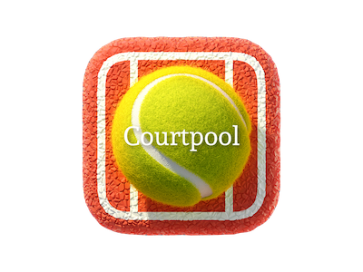

<h1 align="center"> Courtpool</h1>

  
  
  

## Table of contents
* [Description](#description)
* [Technologies](#technologies)
* [Compatibility](#compatibility)
* [Future scope](#future-scope)

## Description
Courtpool app is a tennis players match maker fully built on Android Studio with Java.\
I used Firebase for authentication, database and storage.\
Just create your tennis profile and the app will match you the best players for you.

## Technologies
<b>Project is created with:</b>
* Java
* Firebase version: 26.4.0

## Compatibility
<b>Minimum Android SDK:</b> Courtpool requires a minimum API level of 27.

## Future scope

- Add live chat.
