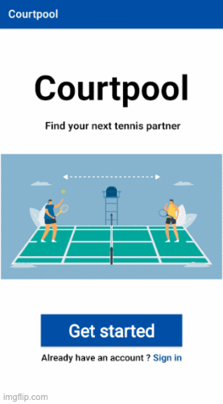
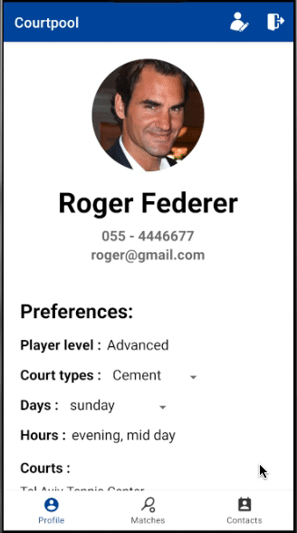

<h1 align="center"> Courtpool</h1>

  
  
  

## Table of contents
* [Description](#description)
* [How to use](#How-to-use)
* [Technologies](#technologies)
* [Compatibility](#compatibility)
* [Future scope](#future-scope)

## Description
Courtpool app is a tennis players match maker fully built on Android Studio with Java.\
I used Firebase for authentication, database and storage.\
Just create your tennis profile and the app will match you the best players for you.

## How to use
For the first time, you will need to create a new user, to do that click on GET STARTED button.\
First, you will need to enter your personal info (e.g. - full name, email)\
Next, you will be asked to choose a courts you like to play at, which type of courts you prefer to play on,\
What is your skill level and finally what days and hours you usually play. 

  

After creating your user, you will enter the main page of the app, where you can see your profile page, matches and your contacts.

  

In your profile page, you will be able to edit your profile by pressing the upper right edit icon or log out with the log out icon.\
In the matches page, you will be able to see the full information of each player by clicking once on the player tab,\
Or adding this player to your contacts by long clicking on his/her tab.

## Technologies
<b>Project is created with:</b>
* Java
* Firebase version: 26.4.0

## Compatibility
<b>Minimum Android SDK:</b> Courtpool requires a minimum API level of 27.

## Future scope

- Add live chat.
